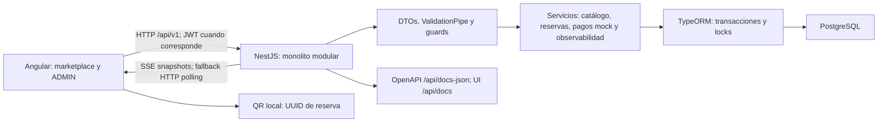

# Arquitectura actual

**Actualmente: monolito modular.** Angular consume una API REST NestJS versionada `/api/v1`; NestJS usa TypeORM con PostgreSQL. AppModule monta AuthModule, AtraccionesModule, ObservabilidadModule y CommonModule. Alojamientos, autos y vuelos de la plantilla no están montados. Reservas, pagos y comentarios están dentro de AtraccionesModule, no son microservicios.

## Componentes y flujos

| Componente real | Responsabilidad / evidencia |
|---|---|
| Angular | HttpClient y API_URL separan consumidor y backend; catálogo, detalle, paquetes y disponibilidad reales. |
| AuthModule y guards globales | Registro/login, Bearer JWT, JwtAuthGuard y RolesGuard; operaciones públicas explícitas. Registro normal crea CLIENTE. |
| AtraccionesModule | CRUD ADMIN, catálogo, paquetes, disponibilidad, checkout, reservas, comentarios; PricingService calcula desde paquete real. |
| PaymentService | Delega a PaymentProvider; token conectado a MockPaymentProvider. No procesa pagos bancarios reales. |
| ObservabilidadModule | Ingesta pública validada/sanitizada; consulta/resumen y SSE protegidos JWT + ADMIN. |
| TypeORM/PostgreSQL | Persistencia mediante entidades/migraciones; synchronize false. |

CLIENTE puede reservar y acceder a sus reservas. ADMIN gestiona atracciones y consulta reservas administrativas/observabilidad. Detalle y cancelación verifican propietario o ADMIN; conocer un UUID/QR no concede autorización. Un 403 representa acceso denegado, no una orden de cerrar sesión.

El checkout recibe paquete, fecha/hora, adultos, edades de niños, cliente y método de pago; el backend valida pertenencia del paquete, límites, políticas, precio y capacidad. Confirma y persiste solo después de SUCCESS del proveedor mock. Devuelve total_price; el consumidor no es autoridad de precio/cupos/estado. Los estados reales son PENDIENTE, CONFIRMADA y CANCELADA. El checkout actual crea CONFIRMADA; la expiración de pendientes históricos evita retener capacidad indefinidamente.

Checkout usa DataSource.transaction, pessimistic_write sobre atracción/turno y pessimistic_read sobre paquete. La actualización de cupos, reserva, pago y registros de éxito comparte transacción. Cancelación bloquea reserva y turno, cambia estado/libera cupos dentro de una transacción y no libera dos veces. UNIQUE de idempotency_key y checks PostgreSQL complementan los locks; las pruebas existentes usan concurrencia real.

X-Idempotency-Key UUID v4 es obligatorio en checkout/cancelación. Checkout compara fingerprint de payload normalizado y devuelve la operación existente o 409 por reutilización incompatible. Cancelación es idempotente por estado/locks, sin fingerprint independiente; una key de checkout asociada a otra reserva produce 400. Detalles en [API-first](API-FIRST.md) y el contrato de checkout.

QR se genera localmente con qrcode-generator y contiene el UUID reservation_id; muestra presentación válida solo para CONFIRMADA. No hay scanner, check-in ni estado USADA.

ObservabilityService Angular captura eventos y envía lotes a la ingesta. Backend persiste observabilidad_eventos y luego señala un Subject local. SSE emite snapshots de los últimos 100 eventos de navegador, reconciliando cada 15 s y renovando conexión a los 55 s. Angular utiliza fetch streaming autenticado; polling cada 3 s es fallback identificado en pantalla. No hay broker ni entrega distribuida garantizada. Registros técnicos de checkout en la misma tabla no se publican como eventos de negocio externos.

## Contrato HTTP y límites

OpenAPI/Swagger es la fuente principal del contrato HTTP: `/api/docs`, `/api/docs-json` y `/api/docs-yaml`. Hay 24 operaciones activas, agrupadas en auth, atracciones, paquetes, disponibilidad, reservas, comentarios, ADMIN y observabilidad. Los paths/DTOs exactos están en Swagger; no se duplica aquí todo el inventario.

main.ts instala Helmet, CORS y ValidationPipe (whitelist, transform, forbidNonWhitelisted); guards globales añaden JWT, roles y rate limiting. PostgreSQL está detrás de la API; Angular no accede directamente a tablas.

## Implementado y futuro

Lo anterior describe implementación actual. Separación en servicios independientes, broker/outbox, eventos de dominio para consumidores externos, móvil, B2B, check-in y proveedor de pagos real son **diseño futuro**. No existen Kafka/RabbitMQ, microservicios, notificaciones o facturación conectados. Véanse [interoperabilidad](INTEROPERABILIDAD.md) y [SOA/EDA](SOA-EDA.md).

Fuentes: backend src/main.ts, app.module.ts, módulos/controllers/servicios; frontend API_URL, servicios HTTP, ReservationQr y dashboard de observabilidad. Para ejecución, consultar el [README](../README.md); para relaciones, [modelo de datos](MODELO-DATOS.md).
