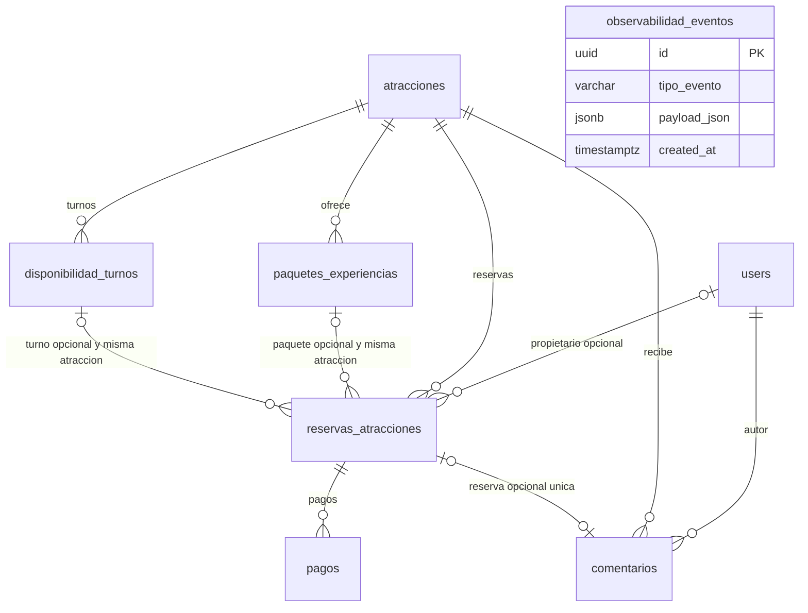

# Modelo de datos real

PostgreSQL almacena **8 tablas de dominio**; `migrations` es infraestructura TypeORM (id, timestamp, name), no una entidad de negocio. Este documento se basa en entidades montadas, nueve migraciones y el catálogo SQL verificado en [database-audit.json](../booking-backend/contracts/evidence/database-audit.json). Evolución mediante migraciones, synchronize false. No incluye entidades de módulos no montados.

## Tablas, claves y constraints

Todas las tablas de dominio tienen PK `id` UUID no nula. Nombres camelCase entre comillas en SQL se conservan tal como existen.

| Tabla | Campos principales reales | Relaciones y constraints |
|---|---|---|
| users | name, email, password_hash, cedula_dni, role, createdAt | email NOT NULL UNIQUE; cédula nullable UNIQUE para valores presentes; enum CLIENTE/ADMIN; hash, nombre, rol y fecha requeridos. |
| atracciones | nombre, descripcion, ciudad, provincia, region, categoria, imagenes, precioBase, precioTicket, cuposTotales, tipoExperienciaPermitidos, horariosDisponibles, product_type, package_prices, price, operator, categories, includes, supported_languages, badges, locations, photos, latitud, longitud, duracionHoras, estaActivo, createdAt, updatedAt, deletedAt | enum SINGLE_TICKET/GUIDED_TOUR/PACKAGE; numeric para precios/coordenadas; JSONB para listas/representaciones; deletedAt nullable (soft delete); índices nombre/provincia/región/categoría. |
| paquetes_experiencias | atraccion_id, tipo_experiencia, nombre_paquete, descripcion, precio_unitario, min_participantes, max_participantes, politicas_json | atraccion_id NOT NULL FK/CASCADE; precio >= 0; descripción/máximo nullable; UNIQUE id/atraccion_id para relación compuesta. |
| disponibilidad_turnos | atraccion_id, fecha, hora_inicio, capacidad_total, cupos_reservados, created_at | atraccion_id NOT NULL FK/CASCADE; UNIQUE atraccion_id/fecha/hora_inicio; capacidad >= 0; 0 <= cupos_reservados <= capacidad_total; UNIQUE id/atraccion_id. |
| reservas_atracciones | idempotency_key, codigo_reserva, request_fingerprint, turno_id, userId, date, time, ticket_count, num_adultos, num_ninos, total_cupos_ocupados, edades_ninos, subtotal, descuentos, monto_total, paquete_id, product_type, customer_name, customer_email, status, atraccion_id, createdAt | key y código NOT NULL UNIQUE; atracción NOT NULL FK/CASCADE; userId nullable FK/RESTRICT; FK compuestas paquete/atracción y turno/atracción (sin borrado en cascada); ticket_count > 0; snapshot total=adultos+niños=ticket_count; participantes >= 0. |
| pagos | reserva_id, metodo_pago, titular_tarjeta, ultimos_cuatro_digitos, monto_pagado, transaccion_hash, fecha_pago | reserva NOT NULL FK/CASCADE; método CREDIT_CARD/PAYPAL; monto >= 0; hash NOT NULL UNIQUE; titular/últimos cuatro nullable. No columnas PAN/CVV. |
| comentarios | atraccion_id, user_id, reserva_id, puntuacion, comentario, fecha_creacion | atracción/usuario NOT NULL FK/CASCADE; reserva nullable FK/CASCADE UNIQUE; puntuación 1–5; texto/fecha requeridos. |
| observabilidad_eventos | tipo_evento, endpoint_ruta, latencia_ms, user_id, payload_json, created_at | tipo/ruta/payload/fecha requeridos; latencia/usuario nullable; user_id no tiene FK; JSONB y timestamp servidor. Telemetría de navegador guarda identidad null. |

Reservas usa enum PENDIENTE/CONFIRMADA/CANCELADA. `paquete_id`, `turno_id`, `request_fingerprint`, `userId`, `product_type`, time y customer_email permiten null para compatibilidad histórica; checkout actual asigna paquete, turno, propietario y fingerprint. Las FK compuestas aseguran que paquete y turno pertenecen a la misma atracción **cuando las referencias están presentes**. No implican que todas las reservas históricas deban tener paquete/turno.

Índices relevantes: usuario/fecha de reservas, tipo/fecha de eventos y atracción/fecha de comentarios, además de los índices UNIQUE y PK. Hay dos índices históricos equivalentes de comentarios; se conservaron, sin afirmar una optimización adicional.

## Relaciones y cardinalidades

En la relación users–reservas, la referencia del lado reserva es opcional: la cardinalidad exacta es cero o un usuario por reserva. El diagrama debe expresar esa opcionalidad; el servicio actual siempre asigna propietario. Un usuario puede tener cero o muchas reservas. Comentarios exige un usuario y una atracción. Una reserva puede tener cero o un comentario por UNIQUE; un comentario histórico puede no tener reserva.

El esquema admite varios pagos por reserva: reserva_id **no es UNIQUE**. Checkout actual crea un pago por compra y los reintentos no crean otro; no debe representarse como una restricción SQL uno-a-uno. observabilidad_eventos se muestra sin relaciones FK; user_id no es una relación SQL. El ledger de capacidad y los snapshots se coordinan mediante transacciones/locks; esa igualdad entre tablas no es una FK ni un CHECK entre tablas.

Las FK de paquetes/turnos son compuestas con atraccion_id; el ER muestra las entidades participantes, mientras la tabla anterior detalla las columnas de las constraints. Desactivar una atracción por soft delete conserva filas/referencias; borrar físicamente puede activar CASCADE o verse restringido por otras FK. RESTRICT en usuario de reservas preserva propietarios y no es borrado automático.

Reglas de comentario confirmado/propio se validan en el servicio; las FK por sí solas no prueban estado/propiedad. No se inventan constraints para esas reglas.

## Evidencia y mantenimiento

[Auditoría PostgreSQL](../CRITERIO-4-BASE-DE-DATOS.md) incluye reconstrucción desde BD vacía, constraints y pruebas reales de persistencia/concurrencia. Las migraciones están en `booking-backend/src/database/migrations`. El esquema actual no contiene tablas de check-in, notificaciones, broker u outbox: son diseños futuros descritos en [SOA/EDA](SOA-EDA.md).
