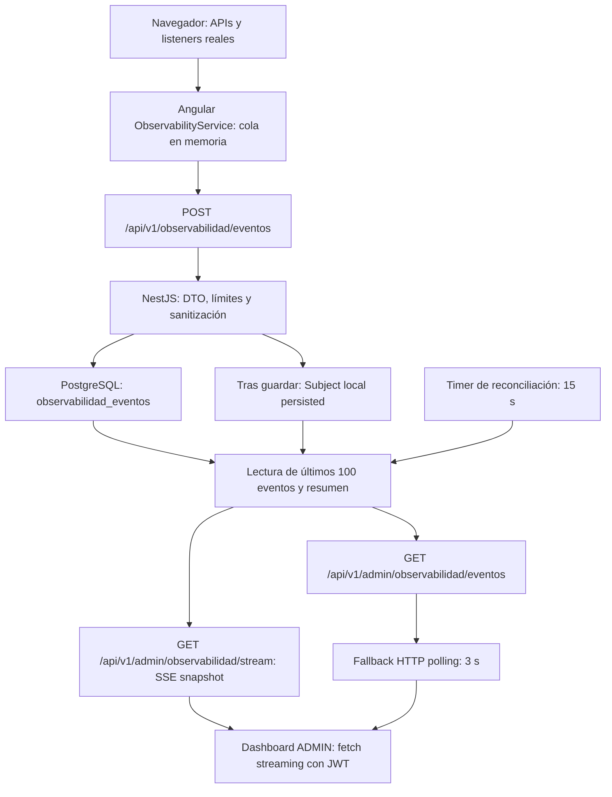
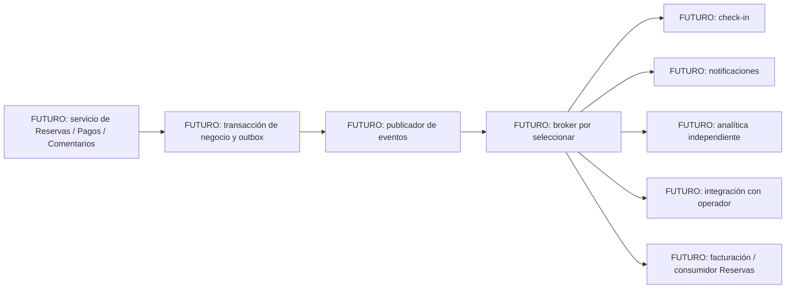

# Diseño preliminar SOA / EDA

## 1. Arquitectura actual

**Actualmente: monolito modular.** NestJS monta AuthModule, AtraccionesModule y ObservabilidadModule en AppModule. Angular es el consumidor web y PostgreSQL es la persistencia detrás de TypeORM. Las operaciones HTTP se exponen bajo `/api/v1`, documentadas en Swagger. No hay microservicios, API Gateway, broker, event bus distribuido ni consumidores externos implementados.

Este documento distingue una evidencia concreta de procesamiento de eventos de observabilidad de un **diseño futuro** de eventos de negocio. No certifica una arquitectura EDA de negocio implementada ni garantías de entrega distribuida.

## 2. Evidencia event-driven implementada

`booking-frontend/src/app/services/observability.service.ts` produce eventos mediante listeners, Router, Performance API y API de conexión con detección de soporte. Mantiene una cola limitada a 100 eventos en memoria; envía lotes de hasta 20 cada 5 segundos o por umbral, con límites de frecuencia. El envío normal descarta eventos encolados con más de 5 minutos; hay reintentos limitados. Al ocultar/cerrar puede utilizar sendBeacon si está disponible. No es una cola durable ni garantiza entrega de todos los eventos.

`booking-backend/src/modules/observabilidad/observabilidad.service.ts` sanitiza y guarda el lote antes de `persisted.next()`. Ese Subject RxJS es **local al proceso**, no un broker. `stream()` combina la señal con un timer, agrupa señales durante 100 ms y consulta PostgreSQL; emite `event: snapshot`, no un mensaje individual por evento. La reconciliación cada 15 segundos permite observar escrituras de otras instancias a través de la BD; no implica un bus distribuido.

SSE se sirve en `GET /api/v1/admin/observabilidad/stream`, con JWT + ADMIN; la conexión termina a los 55 segundos para renovar conexión/autorización. Angular usa fetch streaming con Authorization, recibe snapshots y actualiza el dashboard. Existe fallback polling cada 3 segundos mediante `GET /api/v1/admin/observabilidad/eventos`; la UI identifica el transporte usado. `GET /api/v1/admin/observabilidad/resumen` permite consultar el resumen aparte.

El snapshot contiene hasta 100 eventos recientes, conteos de esa muestra, promedio de carga solo cuando hay al menos dos mediciones y generatedAt. No es un historial completo ni una API de replay con cursor/ack. Esta es la evidencia implementada del flujo productor → API → persistencia → consumidor.

## 3. Eventos de navegador implementados

Nombres exactos de `telemetry.dto.ts` y campos de `telemetry-safety.ts`. El envelope BrowserEventDto contiene category, type, timestamp del navegador, route sanitizada, sessionId UUID aleatorio en memoria y payload plano. El backend añade id y receivedAt en la representación consultada. Estos datos públicos no prueban identidad ni acciones de negocio.

En **todas las filas** el consumidor es ObservabilidadService del backend → API ADMIN → dashboard; la persistencia es `observabilidad_eventos`, con tipo_evento `BROWSER_<CATEGORY>`, endpoint_ruta y payload_json. user_id se guarda null en la ingesta de navegador.

| PRODUCTOR | EVENTO (categoría / type) | PAYLOAD GENERAL | CONSUMIDOR | PERSISTENCIA | PROPÓSITO |
|---|---|---|---|---|---|
| Performance API después de load | PERFORMANCE / navigation_timing | durationMs, domContentLoadedMs, loadMs, resourceCount, resourceDurationMs | Backend y dashboard ADMIN | observabilidad_eventos | Medición real de carga; se omite si no hay soporte/medición completa. |
| Router Angular | PERFORMANCE / route_navigation | durationMs | Backend y dashboard ADMIN | observabilidad_eventos | Duración de navegación SPA. |
| Listener window error | ERROR / window_error | message, filename sanitizados; line | Backend y dashboard ADMIN | observabilidad_eventos | Detectar errores JavaScript. |
| Angular GlobalErrorHandler vía ObservabilityService | ERROR / angular_error | message sanitizado | Backend y dashboard ADMIN | observabilidad_eventos | Registrar errores Angular. |
| Listener unhandledrejection | ERROR / unhandled_rejection | reason sanitizada; objetos no string se omiten | Backend y dashboard ADMIN | observabilidad_eventos | Detectar promesas rechazadas no manejadas. |
| Listener error en captura sobre recursos | RESOURCE_ERROR / resource_error | tag, url sanitizada | Backend y dashboard ADMIN | observabilidad_eventos | Fallos de imágenes/scripts/stylesheets u otros recursos. |
| Listener click en controles relevantes | INTERACTION / click | tag, role, action=activate | Backend y dashboard ADMIN | observabilidad_eventos | Interacción sin contenido de formularios/textos. |
| Listener visibilitychange | VISIBILITY / visibility_change | state: visible/hidden | Backend y dashboard ADMIN | observabilidad_eventos | Estado de pestaña. |
| Captura inicial y resize con debounce 250 ms | VIEWPORT / viewport | width, height, devicePixelRatio | Backend y dashboard ADMIN | observabilidad_eventos | Tamaño real de viewport. |
| navigator.connection y listener change | CONNECTION / connection | supported; effectiveType, downlink, rtt, saveData cuando existen | Backend y dashboard ADMIN | observabilidad_eventos | Entorno de conexión sin inventar mediciones. |
| Detección de APIs y pruebas de storage | CAPABILITY / capabilities | Booleans performance, navigationTiming, networkInformation, localStorage, sessionStorage, eventSource, webSocket, serviceWorker, sendBeacon | Backend y dashboard ADMIN | observabilidad_eventos | Soporte real; detectar WebSocket no significa usarlo como transporte. |
| Interceptor HTTP mediante recordHttp | HTTP / http_request, http_error | method, url sanitizada, durationMs, status | Backend y dashboard ADMIN | observabilidad_eventos | Latencia/fallos HTTP; excluye observabilidad para evitar bucles. |
| Llamadas track / trackEvent del frontend | DOMAIN / application_event | action sanitizada; el contrato permite step/result | Backend y dashboard ADMIN | observabilidad_eventos | Telemetría de aplicación, no evento de dominio confiable. |

## 4. Módulos y responsabilidades actuales

| Módulo / componente actual | Responsabilidad real | Posible servicio futuro |
|---|---|---|
| AuthModule | Registro/login, usuarios y emisión JWT; guards/strategy compartidos | Identity/Auth |
| AtraccionesModule: controllers/servicio y paquetes | Catálogo, CRUD ADMIN, paquetes y disponibilidad | Catálogo de Atracciones |
| AtraccionesModule: operaciones de reservas | Checkout, capacidad, idempotencia, detalle, cancelación | Reservas |
| PaymentService + PaymentProvider | Abstracción interna conectada a MockPaymentProvider | Pagos |
| ComentariosController y lógica en AtraccionesService | Comentarios asociados a reserva propia confirmada | Comentarios |
| ObservabilidadModule + entidad de eventos | Ingesta, lectura, resumen y SSE | Observabilidad |

Reservas, pagos y comentarios **no son servicios desplegados ni módulos Nest separados actualmente**: están dentro de AtraccionesModule. CommonModule/guards apoyan seguridad; no son un servicio de integración externo.

El checkout ya guarda registros técnicos `RESERVATION_CONFIRMED` y `PAYMENT_SUCCESS` en la misma transacción de éxito; ante pago mock rechazado guarda `CHECKOUT_FAIL` después del rollback. Estos registros existen en `observabilidad_eventos`, pero **no se publican a consumidores independientes**. La consulta browser/SSE filtra BROWSER_ y no sirve esos registros como un stream de negocio. No equivalen a los eventos futuros siguientes.

## 5. Eventos de dominio futuros y contratos preliminares

**Todos los contratos de esta sección son FUTURO / NO IMPLEMENTADO.** No son DTOs HTTP existentes, topics creados ni publicaciones actuales. El diseño propone un envelope común:

| Campo conceptual | Tipo propuesto | Significado |
|---|---|---|
| eventId | UUID | Identificador estable del evento; permite deduplicación. |
| eventType | String | Nombre explícito del evento de la tabla siguiente. |
| occurredAt | ISO8601 UTC | Instante de negocio asignado por backend. |
| aggregateId | UUID | Reserva, pago o comentario al que pertenece el evento. |
| version | Integer, inicialmente 1 | Versión del contrato de evento, distinta del prefijo HTTP. |
| payload | Objeto mínimo | Campos específicos siguientes; sin PII ni credenciales. |

| Evento y estado | Productor futuro / condición conceptual | aggregateId | Payload mínimo propuesto | Consumidores posibles, todos FUTUROS |
|---|---|---|---|---|
| ReservaCreada — FUTURO / NO IMPLEMENTADO | Reservas, tras persistir una nueva reserva | reservationId | attractionId, packageId | Analítica y operador autorizado |
| ReservaConfirmada — FUTURO / NO IMPLEMENTADO | Reservas, tras confirmación persistida | reservationId | attractionId, packageId, date, time, occupiedSeats | Check-in, notificaciones, analítica, operador |
| ReservaCancelada — FUTURO / NO IMPLEMENTADO | Reservas, tras cancelar y liberar cupos | reservationId | attractionId, slotId, releasedSeats | Check-in, analítica, operador |
| PagoProcesado — FUTURO / NO IMPLEMENTADO | Pagos, tras resultado persistido verificable | paymentId | reservationId, result: SUCCESS/FAILED | Reservas, facturación y notificaciones |
| ComentarioCreado — FUTURO / NO IMPLEMENTADO | Comentarios, tras persistir comentario válido | commentId | attractionId, reservationId, rating | Analítica y operador |

Los IDs de payload son referencias conceptuales a los datos existentes, no nuevas propiedades aceptadas por las APIs actuales. date/time y conteos se restringirían a consumidores autorizados; el evento no incluye nombre, email, cédula, texto libre de comentario/reason ni datos de tarjeta. Si un consumidor requiere datos adicionales, deberá resolverlos mediante un contrato autorizado, no recibirlos indiscriminadamente por broadcast.

ReservaCreada y ReservaConfirmada podrían coincidir en el checkout síncrono actual: el diseño futuro deberá decidir si ambos son útiles y fijar el orden sin inventar un nuevo estado hoy. PagoProcesado FAILED no implica que exista una reserva persistida en el flujo actual: el rechazo de pago revierte el checkout. Si se mantiene ese rollback, un evento de fallo requerirá una correlación/identidad de intento que debe diseñarse antes de implementarlo; no se puede prometer un reservationId existente. La tabla describe el resultado de pago cuando hay relación persistida válida, no cambia la semántica actual.

## 6. Posible evolución SOA

**Posible evolución futura: servicios independientes.** Las responsabilidades anteriores delimitan candidatos, no obligan a separarlos. Primero deberán definirse contratos de servicio, ownership de datos, identidades/permisos y operación. El versionado `/api/v1` y los DTOs actuales son evidencia de límites HTTP consumibles, no evidencia de despliegues independientes.

Separar Reservas, Catálogo y Pagos rompería la atomicidad local del checkout existente. Antes de hacerlo habría que diseñar coordinación, compensación/reconciliación y tratamiento de fallos; no se supone que una transacción PostgreSQL pueda abarcar un proveedor real o múltiples servicios. No se propone cambiar esta arquitectura durante el criterio.

## 7. Posible evolución EDA

El diseño futuro propone persistir una outbox junto al cambio de negocio y publicar después del commit, evitando la ventana «BD guardada pero evento perdido» o eventos de transacciones revertidas. **No existe outbox implementada actualmente.** Kafka/RabbitMQ son únicamente alternativas futuras; no se selecciona ni instala ninguna.

Una implementación futura deberá definir reintentos, deduplicación por eventId, orden por aggregateId, compatibilidad de version, acknowledgements, retención/replay y recuperación de fallos. Si se adopta entrega al menos una vez, los consumidores necesitarán ser idempotentes; no se afirma exactly-once. El Subject/SSE actual de observabilidad no proporciona esas garantías.

Ejemplo conceptual **FUTURO**: ReservaConfirmada se distribuye a un sistema de check-in para preparar validación, a notificaciones para informar, a analítica para medir y a un operador autorizado para gestión. Son consumidores paralelos posibles, no una cadena existente. Ninguno de estos consumidores externos está conectado hoy.

Ejemplo conceptual **FUTURO**: PagoProcesado sería consumido por Reservas para aplicar la transición definida, facturación para producir documentos y notificaciones para comunicar resultados. Actualmente el checkout procesa el pago mock síncronamente; no espera mensajes de un broker y no hay facturación/notificaciones implementadas.

## 8. Seguridad y privacidad

La ingesta actual utiliza BrowserBatchDto, whitelist de categorías/tipos/campos, validación de valores planos, máximo 20 eventos/lote, 2 KiB/payload, 48 KiB/lote y rate limiting. Las URLs pierden query/hash y se redactan segmentos sensibles; textos se sanitizan. Clics no registran valores de formularios ni textContent. No se envía JWT a la ingesta pública, que utiliza HttpBackend para evitar interceptores y bucles de telemetría.

La consulta y SSE ADMIN exigen JWT + ADMIN. sessionId es aleatorio en memoria y user_id de navegador es null; telemetría pública no es prueba de identidad ni autoridad de negocio. El almacenamiento no constituye un archivo de auditoría inmutable ni garantiza conservar todo el historial en el stream.

Los contratos futuros no deben contener JWT, passwords, PAN, CVV, cookies o PII innecesaria. IDs opacos no conceden permisos. La evolución requerirá autorización por consumidor, mínimo acceso, transporte protegido y políticas de retención; son requisitos futuros, no controles de broker ya instalados. Los contratos propuestos evitan payloads completos de requests, pagos y formularios.

## 9. IMPLEMENTADO frente a FUTURO y verificación

| IMPLEMENTADO HOY | FUTURO / NO IMPLEMENTADO |
|---|---|
| Monolito modular NestJS; Angular; PostgreSQL | Servicios independientes SOA |
| Eventos de navegador, batching, validación y persistencia | Publicación de los cinco contratos de dominio propuestos |
| Subject local tras persistencia, snapshots SSE y polling fallback | Broker/event bus distribuido, outbox y consumidores independientes |
| Registros técnicos de checkout en observabilidad_eventos | Notificaciones, facturación, integración de operador y analítica externa |
| MockPaymentProvider; QR local de presentación | Proveedor de pagos real y check-in QR |

La auditoría documental se basó en `telemetry.dto.ts`, `telemetry-safety.ts`, `observabilidad.service.ts`, controllers de observabilidad, ObservabilityService Angular, dashboard/servicio SSE, AppModule, AtraccionesModule y escrituras de eventos del checkout. Se verificaron nombres de eventos, campos permitidos y mecanismo de entrega en el código real; no se modificó funcionalidad ni se instalaron tecnologías. Las pruebas de persistencia/SSE existentes están en `booking-backend/test/observabilidad.test.cjs`; esta tarea documental no requiere repetir la suite.

ARQUITECTURA ACTUAL DOCUMENTADA: SÍ

EVENTOS REALES DE OBSERVABILIDAD DOCUMENTADOS: SÍ

PRODUCTORES Y CONSUMIDORES IDENTIFICADOS: SÍ

EVENTOS FUTUROS DE DOMINIO DEFINIDOS: SÍ

CONTRATOS PRELIMINARES DEFINIDOS: SÍ

EVOLUCIÓN SOA DOCUMENTADA: SÍ

EVOLUCIÓN EDA DOCUMENTADA: SÍ

IMPLEMENTADO Y FUTURO ESTÁN CLARAMENTE SEPARADOS: SÍ

SE AFIRMA USAR TECNOLOGÍA QUE NO EXISTE: NO

DOCUMENTO `docs/SOA-EDA.md`: CREADO

CRITERIO "DISEÑO PRELIMINAR DE EVENTOS O SERVICIOS PARA FUTURA INTEGRACIÓN (SOA/EDA)": CUMPLE
